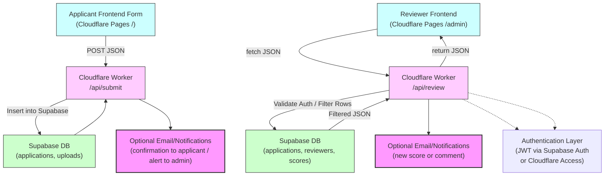

# Scholarship Application Platform

A modern scholarship application platform built with Cloudflare Pages, Cloudflare Workers, and Supabase.

## Architecture

- **Frontend**: Cloudflare Pages (static HTML/CSS/JS)
- **Backend**: Cloudflare Worker API
- **Database**: Supabase (PostgreSQL)

## Project Structure

```
scholarship-app/
├── frontend/          # Cloudflare Pages static site
│   ├── index.html     # Main application form
│   ├── src/           # Styles and JavaScript
│   └── package.json
├── worker/            # Cloudflare Worker API backend
│   ├── src/worker.js  # API endpoints
│   ├── wrangler.toml  # Worker configuration
│   └── package.json
├── supabase/          # Database migrations and config
│   ├── migrations/   # SQL migration files
│   └── config.toml
└── .github/workflows/ # CI/CD pipelines
```
## Layer Integration Visualization


## Setup Instructions

### 1. Supabase Setup

1. Install Supabase CLI:
   ```bash
   npm install -g supabase
   ```

2. Create a new Supabase project and get your project URL

3. Update `supabase/config.toml` with your project reference

4. Apply migrations:
   ```bash
   cd supabase
   supabase db push
   ```

### 2. Cloudflare Worker Setup

1. Navigate to the worker directory:
   ```bash
   cd worker
   npm install
   ```

2. Update `wrangler.toml` with your Supabase URL

3. Set the Supabase service role key as a secret:
   ```bash
   npx wrangler secret put SUPABASE_SERVICE_ROLE_KEY
   ```

4. Test locally:
   ```bash
   npm run dev
   ```

### 3. Frontend Setup

1. Navigate to the frontend directory:
   ```bash
   cd frontend
   ```

2. Run locally:
   ```bash
   npm run dev
   ```

### 4. Cloudflare Pages Deployment

1. Create a new Cloudflare Pages project
2. Connect it to this repository
3. Set up a Worker binding:
   - Worker name: `scholarship-api`
   - Route: `/api/*`

### 5. GitHub Actions

Set up the following repository secrets:

- `CLOUDFLARE_API_TOKEN`: Your Cloudflare API token
- `CLOUDFLARE_ACCOUNT_ID`: Your Cloudflare account ID

## Environment Variables

### Cloudflare Worker
- `SUPABASE_URL`: Your Supabase project URL
- `SUPABASE_SERVICE_ROLE_KEY`: Service role key (set as secret)

## API Endpoints

- `POST /api/submit` - Submit a scholarship application

## Database Schema

The `applications` table stores scholarship submissions with the following fields:
- `id` (UUID, primary key)
- `full_name` (text, required)
- `email` (text, required, unique)
- `phone` (text, optional)
- `essay` (text, optional)
- `created_at` (timestamp)

## Local Development

1. Start Supabase locally:
   ```bash
   supabase start
   ```

2. Start the Worker:
   ```bash
   cd worker && npm run dev
   ```

3. Start the frontend:
   ```bash
   cd frontend && npm run dev
   ```

## Deployment

The project uses GitHub Actions for automatic deployment to both Cloudflare Workers and Cloudflare Pages when pushing to the main branch.
