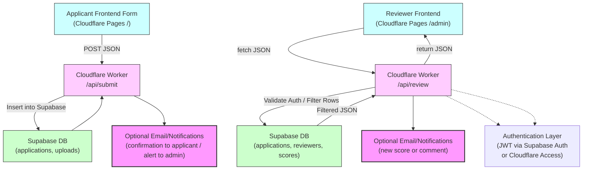

# Scholarship Application Platform

A modern scholarship application platform built with Cloudflare Pages, Cloudflare Workers, and Supabase.

## Architecture

- **Frontend**: Cloudflare Pages (static HTML/CSS/JS)
- **Backend**: Cloudflare Worker API
- **Database**: Supabase (PostgreSQL)

## Project Structure

```
scholarship-app/
├── frontend/          # Cloudflare Pages static site
│   ├── index.html     # Main application form
│   ├── src/           # Styles and JavaScript
│   └── package.json
├── worker/            # Cloudflare Worker API backend
│   ├── src/worker.js  # API endpoints
│   ├── wrangler.toml  # Worker configuration
│   └── package.json
├── supabase/          # Database migrations and config
│   ├── migrations/   # SQL migration files
│   └── config.toml
└── .github/workflows/ # CI/CD pipelines
```
## Layer Integration Visualization


## Setup Instructions

### 1. Supabase Setup

1. Install Supabase CLI:
   ```bash
   npm install -g supabase
   ```

2. Create a new Supabase project and get your project URL

3. Update `supabase/config.toml` with your project reference

4. Apply migrations:
   ```bash
   cd supabase
   supabase db push
   ```

### 2. Cloudflare Worker Setup

1. Navigate to the worker directory:
   ```bash
   cd worker
   npm install
   ```

2. Update `wrangler.toml` with your Supabase URL

3. Set the Supabase service role key as a secret:
   ```bash
   npx wrangler secret put SUPABASE_SERVICE_ROLE_KEY
   ```

4. Test locally:
   ```bash
   npm run dev
   ```

### 3. Frontend Setup

1. Navigate to the frontend directory:
   ```bash
   cd frontend
   ```

2. Run locally:
   ```bash
   npm run dev
   ```

### 4. Cloudflare Pages Deployment

1. Create a new Cloudflare Pages project
2. Connect it to this repository
3. Set up a Worker binding:
   - Worker name: `scholarship-api`
   - Route: `/api/*`

### 5. GitHub Actions

Set up the following repository secrets:

- `CLOUDFLARE_API_TOKEN`: Your Cloudflare API token
- `CLOUDFLARE_ACCOUNT_ID`: Your Cloudflare account ID

## Environment Variables

### Cloudflare Worker
- `SUPABASE_URL`: Your Supabase project URL
- `SUPABASE_SERVICE_ROLE_KEY`: Service role key (set as secret)

## API Endpoints

- `POST /api/submit` - Submit a scholarship application

## Database Schema

The `applications` table stores scholarship submissions with the following fields:
- `id` (UUID, primary key)
- `full_name` (text, required)
- `email` (text, required, unique)
- `phone` (text, optional)
- `essay` (text, optional)
- `created_at` (timestamp)

## Local Development

1. Start Supabase locally:
   ```bash
   supabase start
   ```

2. Start the Worker:
   ```bash
   cd worker && npm run dev
   ```

3. Start the frontend:
   ```bash
   cd frontend && npm run dev
   ```

## Form Definitions

The platform uses JSON Schema for form definitions and UI Schema for presentation. This section provides examples for all supported form types.

### Form Schema Structure

Each scholarship has two schema components:
- **form_schema**: JSON Schema defining the form structure, validation rules, and data types
- **ui_schema**: UI Schema defining presentation, widgets, and layout hints

### Supported Form Field Types

#### 1. Short Text Fields

Basic text input with validation:

```json
{
  "fullName": {
    "type": "string",
    "title": "Full Name",
    "minLength": 2,
    "maxLength": 100
  },
  "email": {
    "type": "string",
    "format": "email",
    "title": "Email Address",
    "description": "Your WSU or personal email address"
  },
  "phone": {
    "type": "string",
    "title": "Phone Number",
    "pattern": "^\\d{3}-\\d{3}-\\d{4}$",
    "description": "Format: 555-123-4567"
  }
}
```

UI Schema:
```json
{
  "fullName": {
    "ui:autofocus": true,
    "ui:placeholder": "Enter your full legal name"
  },
  "email": {
    "ui:placeholder": "your.email@wsu.edu"
  },
  "phone": {
    "ui:placeholder": "555-123-4567"
  }
}
```

#### 2. Long Text Fields (Textarea)

Multi-line text input for essays and descriptions:

```json
{
  "essay": {
    "type": "string",
    "title": "Personal Statement",
    "description": "Why do you deserve this scholarship? (500-1000 words)",
    "minLength": 500,
    "maxLength": 2000
  },
  "communityService": {
    "type": "string",
    "title": "Community Service Involvement",
    "description": "Describe your community service activities and hours volunteered",
    "minLength": 50
  }
}
```

UI Schema:
```json
{
  "essay": {
    "ui:widget": "textarea",
    "ui:options": {
      "rows": 12
    },
    "ui:help": "Take your time to write a thoughtful response. This is the most important part of your application."
  },
  "communityService": {
    "ui:widget": "textarea",
    "ui:options": {
      "rows": 4
    }
  }
}
```

#### 3. Number Fields

Numeric input with validation:

```json
{
  "gpa": {
    "type": "number",
    "title": "Current GPA",
    "minimum": 0.0,
    "maximum": 4.0,
    "multipleOf": 0.01,
    "description": "Your current cumulative GPA on a 4.0 scale"
  },
  "currentGPA": {
    "type": "number",
    "title": "Current Cumulative GPA",
    "minimum": 3.0,
    "maximum": 4.0,
    "multipleOf": 0.01,
    "description": "Minimum 3.0 GPA required"
  }
}
```

UI Schema:
```json
{
  "gpa": {
    "ui:help": "Enter your GPA as a decimal (e.g., 3.75)"
  },
  "currentGPA": {
    "ui:help": "Applicants must have a minimum 3.0 GPA to be eligible"
  }
}
```

#### 4. Select/Dropdown Fields

Single selection from predefined options:

```json
{
  "major": {
    "type": "string",
    "title": "Major/Field of Study",
    "enum": ["Accounting", "Business Administration", "Computer Science", "Engineering", "Finance", "Marketing", "Other"],
    "description": "Select your primary field of study"
  }
}
```

#### 5. Date Fields

Date picker for dates:

```json
{
  "startDate": {
    "type": "string",
    "format": "date",
    "title": "Start Date"
  },
  "endDate": {
    "type": "string",
    "format": "date",
    "title": "End Date (or current)"
  }
}
```

#### 6. Multiple Object Arrays (Leadership Roles, Awards)

Dynamic arrays for multiple entries like leadership positions or academic honors:

```json
{
  "leadershipExperience": {
    "type": "array",
    "title": "Leadership Experience",
    "description": "List any leadership positions you have held",
    "items": {
      "type": "object",
      "properties": {
        "organization": {
          "type": "string",
          "title": "Organization Name"
        },
        "position": {
          "type": "string",
          "title": "Position/Role"
        },
        "startDate": {
          "type": "string",
          "format": "date",
          "title": "Start Date"
        },
        "endDate": {
          "type": "string",
          "format": "date",
          "title": "End Date (or current)"
        },
        "description": {
          "type": "string",
          "title": "Responsibilities & Achievements"
        }
      }
    }
  },
  "leadershipRoles": {
    "type": "array",
    "title": "Leadership Positions",
    "description": "List all leadership positions you have held (minimum 2 required)",
    "minItems": 2,
    "items": {
      "type": "object",
      "required": ["organization", "position", "startDate"],
      "properties": {
        "organization": {
          "type": "string",
          "title": "Organization"
        },
        "position": {
          "type": "string",
          "title": "Position/Role"
        },
        "startDate": {
          "type": "string",
          "format": "date",
          "title": "Start Date"
        },
        "endDate": {
          "type": "string",
          "format": "date",
          "title": "End Date (leave blank if current)"
        },
        "achievements": {
          "type": "string",
          "title": "Key Achievements",
          "description": "What did you accomplish in this role?"
        }
      }
    }
  }
}
```

UI Schema for Arrays:
```json
{
  "leadershipExperience": {
    "ui:options": {
      "orderable": false
    },
    "items": {
      "description": {
        "ui:widget": "textarea",
        "ui:options": {
          "rows": 3
        }
      }
    }
  },
  "leadershipRoles": {
    "items": {
      "achievements": {
        "ui:widget": "textarea",
        "ui:options": {
          "rows": 3
        }
      }
    },
    "ui:options": {
      "addable": true,
      "removable": true,
      "orderable": false
    }
  }
}
```

### Complete Form Examples

#### Simple Scholarship Application

```json
{
  "title": "Simple Test Application",
  "type": "object",
  "required": ["fullName", "email", "essay"],
  "properties": {
    "fullName": {
      "type": "string",
      "title": "Full Name"
    },
    "email": {
      "type": "string",
      "format": "email",
      "title": "Email Address"
    },
    "essay": {
      "type": "string",
      "title": "Why do you deserve this scholarship?",
      "minLength": 100
    }
  }
}
```

#### Complex Scholarship with Multiple Field Types

See the complete examples in `supabase/seed.sql` for full form schemas including:
- WSU Fiji Chapter Scholarship 2025
- WSU Fiji Leadership Award 2025
- WSU Fiji Academic Achievement Scholarship 2025

### Form Validation Features

- **Required fields**: Using the `required` array in the schema root
- **String validation**: `minLength`, `maxLength`, `pattern`, `format`
- **Number validation**: `minimum`, `maximum`, `multipleOf`
- **Array validation**: `minItems`, `maxItems`
- **Object validation**: Required fields within nested objects

### UI Schema Features

- **Custom widgets**: `textarea`, `select`, etc.
- **Placeholder text**: `ui:placeholder`
- **Help text**: `ui:help`
- **Field focus**: `ui:autofocus`
- **Array options**: `addable`, `removable`, `orderable`
- **Textarea rows**: `ui:options.rows`

## Deployment

The project uses GitHub Actions for automatic deployment to both Cloudflare Workers and Cloudflare Pages when pushing to the main branch.
